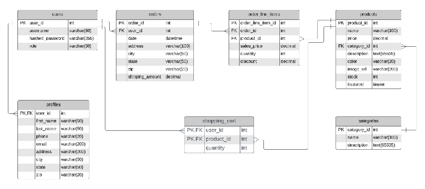
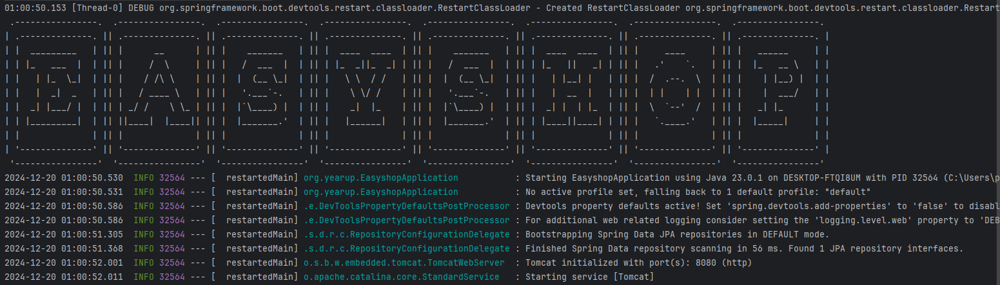
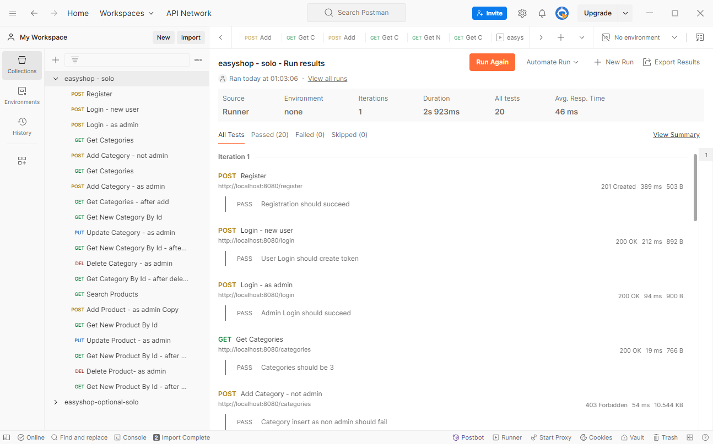
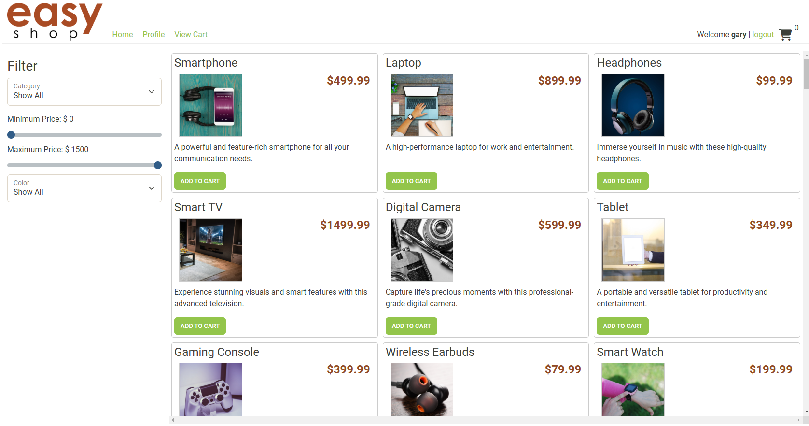

# EasyShop Backend

## Class Diagram

## Project Description
Easy Shop is a simple, mock-up website. The backend uses SpringBoot to handle RESTful API calls. The original template included bugs that I needed to fix to make it operational.

## User Stories
> - As a user I should be able to order items by category so I can buy what I exactly want.
> - As a user I should be able to log in to the website to see my unique information.
> - As a user, I should be able to add all the items I want to buy to a cart, so that I can purchase everything I want at once.
> - As a admin, I should be able to add items to categories so that users can see an updated inventory.
> - As a user I should be able to search for a product and get the correct information, so I can purchase what I exactly want.
> - As an administrator I should be able to update products so that my customers can see an accurate inventory of the items we have.

## Setup

Instructions on how to set up and run the project using IntelliJ IDEA.

### Prerequisites

- IntelliJ IDEA: Ensure you have IntelliJ IDEA installed, which you can download from [here](https://www.jetbrains.com/idea/download/).
- Java SDK: Make sure Java SDK is installed and configured in IntelliJ.
- MySQL or MySQLWorkbench for configuring the database schema.
- Optional: Postman to test API requests.

### Setting up the database in MySQLWorkbench
1. Open MySQL Workbench
2. Open the Schema File
3. Execute the Schema File

### Running the Application in IntelliJ

Follow these steps to get your application running within IntelliJ IDEA:

1. Open IntelliJ IDEA.
2. Select "Open" and navigate to the directory where you cloned or downloaded the project.
3. After the project opens, wait for IntelliJ to index the files and set up the project.
4. Find the main class with the `public static void main(String[] args)` method.
5. Right-click on the file and select 'Run 'EasyshopApplication.main()'' to start the application.

## Technologies Used

- IntelliJ IDEA 2023.3.3 (Ultimate Edition)
- Java 17 (Amazon Corretto 17.0.12)
- MySQL
- Postman
- Springboot framework

## Demo
### Console Start

### Postman

### Frontend

## Future Work

Outline potential future enhancements or functionalities you might consider adding:

- Implement Shopping Cart
- Implement User Profile
- Implement Checkout
- Implement Search Bar

## Resources (used for JPA practice)
- https://www.baeldung.com/jpa-composite-primary-keys
- https://spring.io/guides/gs/accessing-data-jpa

## Thanks
Thank you to Raymond for continuous support and guidance.

